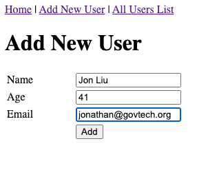
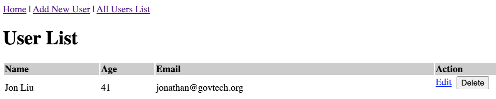

# Product Name
A simple and basic CRUD application (Create, Read, Update, Delete) using Node.js, Express, MySQL & EJS Templating Engine.

## Installation

Follow these steps to setup Node.js on your machine. 

(Tested on OS X 10.15.6 and Amazon Linux version 2)
 
```
1. curl -o- https://raw.githubusercontent.com/nvm-sh/nvm/v0.34.0/install.sh | bash
2. . ~/.nvm/nvm.sh
3. nvm install node
4. node -e "console.log('Running Node.js ' + process.version)"
```

## Usage example

You can add your name to the user list and display all users. Give it a spin.  






## Development setup

Follow these steps to run the crud app on your local machine.  

```
1. git clone git@github.com:sianliu/symbiosis.git 
2. cd symbiosis/ && cd crud-mysql/
3. npm install
4. node app.js
```

## Meta

Your Name – [@YourTwitter](https://twitter.com/sianjon) – jonathan@govtech.org

Distributed under the XYZ license. See ``LICENSE`` for more information.

[https://github.com/sianliu/symbiosis](https://github.com/sianliu/)

## Acknowledgements

Source code for crud-app taken and modified from Mukesh Chapagain's Blog [here](http://blog.chapagain.com.np/node-js-express-mysql-simple-add-edit-delete-view-crud/)
